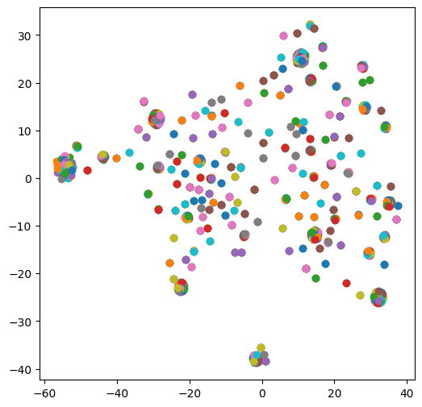
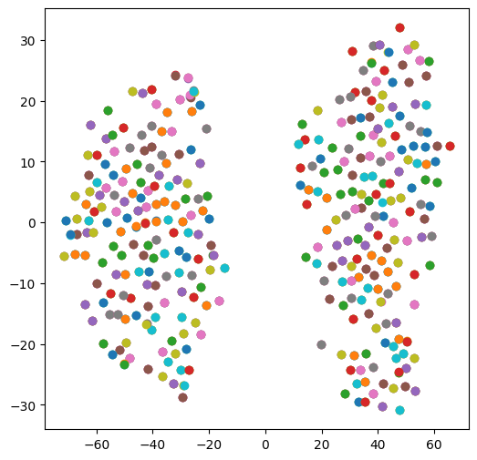
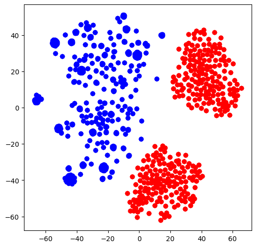
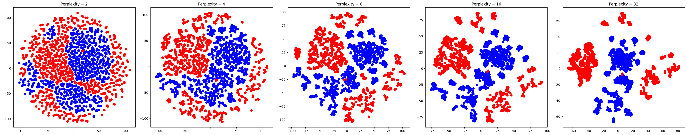

# Domain Adaptation Between VQA V2 and VQA Abdtract

## Archetecture

## t-SNE Visualization of embeddings 

The goal essentially is to get indistinguishable embeddings from each domain. The following are the methods used to arrive to it. 

## 1. Naive concatination of isolated embeddings

See the figure of the architecture given above. This method is fusing the embeddings fresh out of encoders. 

    
    
<strong>Figure 1:</strong> VQA V2

    
    
<strong>Figure 2:</strong> VQA Abstract 

    
    
<strong>Figure 3:</strong> Both visualised on same space 

### Inferences:

- **Abstract dataset** exhibits two major clusters: indoor and outdoor environments.
- **VQA V2** and **Abstract** datasets differ significantly in their image embeddings, which is expected due to the differing nature of the images, even though the questions are quite similar.
- **VQA V2** shows less diversity in its embeddings, as evidenced by the tightly bound clusters in the concatenated t-SNE visualization. In contrast, the **Abstract** dataset demonstrates greater diversity, with a more uniform and widespread distribution of clusters.

## 2. Concatination of attended embeddings

    

## Inferences:
- Higher perplexity t-SNE plots tend to more global structure focus.
- These look better than previous approach but its far from homogeneous.

## 3. Naive dataset concatination
In this, both datasets are simply concatinated and trained over same number of samples each.

TODO

## 4. Importance sampling

TODO

## 5. DANN

TODO