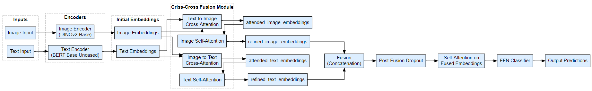
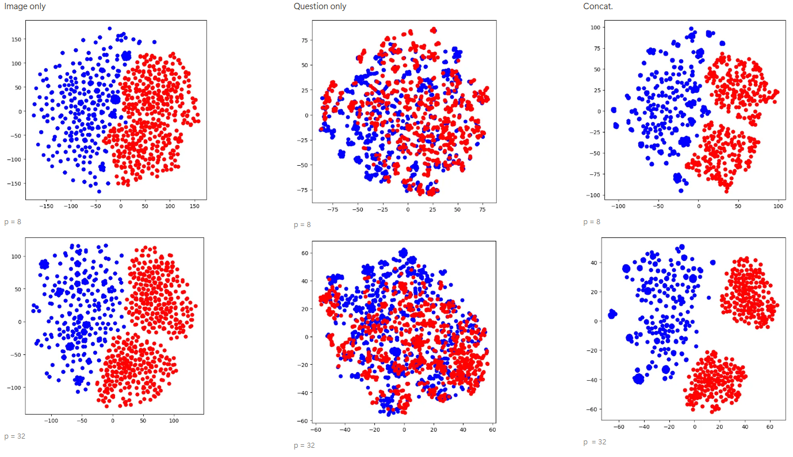
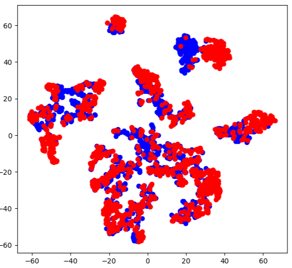

# Few-Shot Visual Question Answering (VQA) with Domain Adaptation

## Project Overview

This repository contains my research and implementation of a Few-Shot Learning approach to Visual Question Answering (VQA) using Domain Adaptation techniques. VQA is a challenging task that requires AI models to interpret both visual and textual information simultaneously to answer natural language questions about images.

<!-- 
[PLACEHOLDER: Overview image showing examples of VQA tasks]
-->

## Technical Highlights

- **Domain Adversarial Neural Networks (DANN)**: Implemented a DANN architecture to enable domain adaptation between different VQA datasets
- **Multi-modal Fusion**: Developed advanced cross-attention mechanisms for effective fusion of visual and textual features
- **Transfer Learning**: Utilized pre-trained models (DinoV2, BERT) as feature extractors for efficient knowledge transfer
- **Few-Shot Learning**: Designed a system capable of performing VQA tasks with limited labeled examples
- **Domain Adaptation**: Applied techniques to improve model generalization across different visual domains

## Architecture

The core architecture consists of:

1. **Visual Encoder**: Uses Facebook's DinoV2 to extract image features
2. **Text Encoder**: Leverages BERT to encode question semantics
3. **Cross-Modal Fusion**: Employs multi-head attention to effectively combine visual and textual information
4. **Domain Adaptation**: Implements adversarial training to align feature distributions between domains
5. **Classification Heads**: Specialized classifiers for answer prediction and domain classification

<!-- 
## Sample Examples

[PLACEHOLDER: Examples of VQA v2 (real images) and VQA-Abstract with model predictions]
-->

## Skills Demonstrated

- **Deep Learning**: Experience with PyTorch, transformers, and attention mechanisms
- **Computer Vision**: Knowledge of visual feature extraction and processing
- **Natural Language Processing**: Text encoding and understanding
- **Transfer Learning**: Effective use of pre-trained models
- **Experimental Design**: Systematic approach to hyperparameter tuning and model evaluation
- **Domain Adaptation**: Techniques to handle distribution shifts between datasets

## Datasets

The project utilizes two VQA datasets:
- **VQA v2**: Contains real-world images with corresponding questions and answers
- **VQA-Abstract**: Features abstract scenes with corresponding questions and answers

<!-- 
[PLACEHOLDER: Visual comparison between VQA v2 and VQA-Abstract datasets]
-->

## Results

The approach demonstrates substantial improvements in few-shot VQA performance, particularly when transferring knowledge between domains with different visual characteristics. For detailed results, please refer to the technical report included in this repository.

<!-- 
[PLACEHOLDER: Performance comparison chart showing improvements over baselines]
-->
### Baseline t-SNE 

### t-SNE After Our Approach

## Technical Documentation

For a detailed explanation of the methodology, architecture, and experimental results, please see the included [technical report](FQA_RnD_Report.pdf).

## Contact

Feel free to reach out for any questions or potential opportunities!
